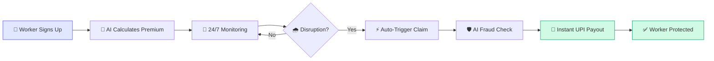
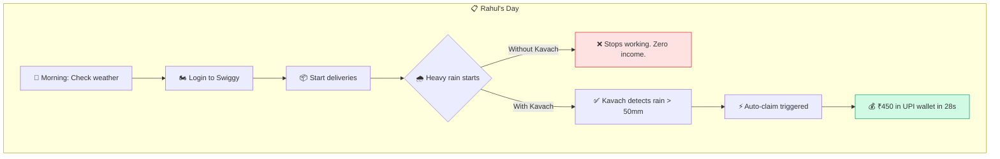
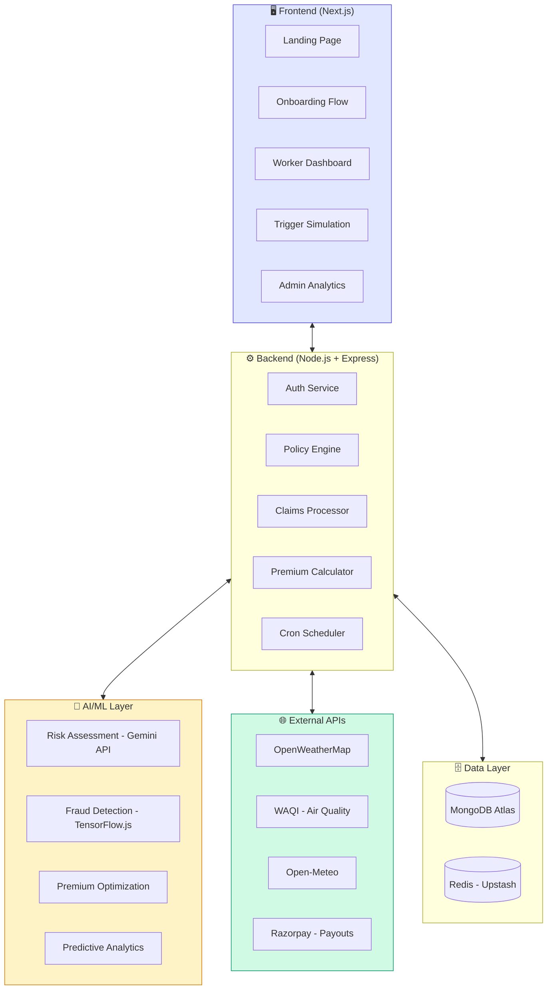
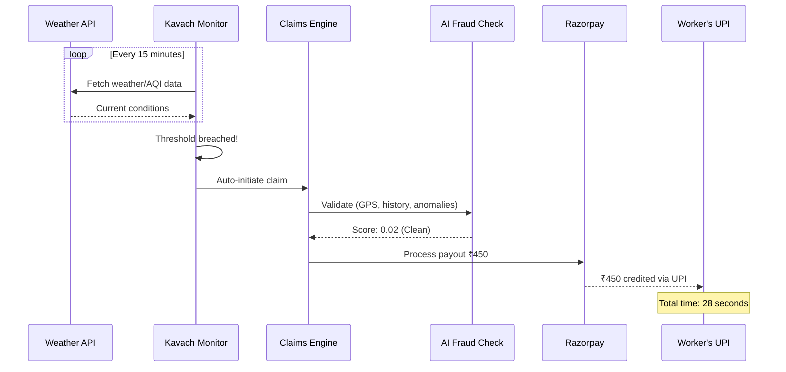
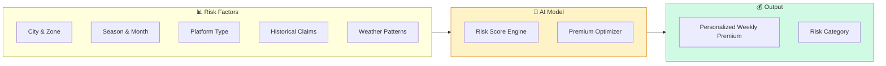
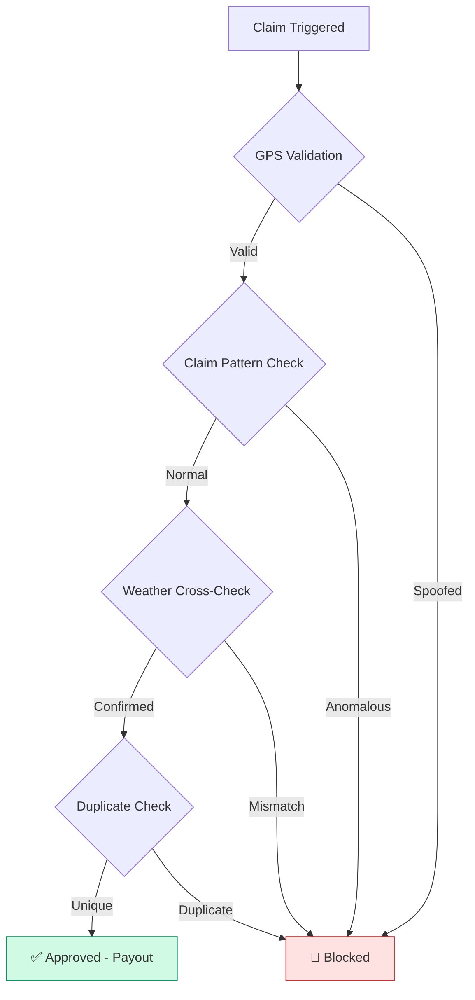
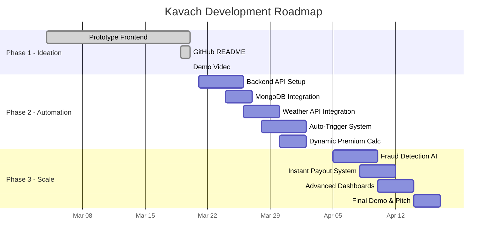

<p align="center">
  
</p>

<h1 align="center">Kavach — AI-Powered Income Protection for Gig Workers</h1>

<p align="center">
  <strong>Parametric insurance that pays delivery workers instantly when disruptions strike.</strong><br/>
  No claims. No paperwork. Just protection.
</p>

<p align="center">
  
  
  
  
</p>

---

## 📌 Problem Statement

India has **50M+ gig delivery workers** powering platforms like Zomato, Swiggy, Zepto, and Amazon. When external disruptions hit — heavy rainfall, extreme pollution, platform outages — these workers lose **20–30% of their monthly earnings** with **zero income protection**.

Traditional insurance doesn't work for them:
- ❌ Slow claims (72+ hours)
- ❌ Complex paperwork
- ❌ Monthly premiums misaligned with weekly pay cycles
- ❌ No coverage for gig-specific income loss

---

## 💡 Our Solution: Kavach

**Kavach** is an AI-powered **parametric insurance platform** that automatically protects delivery workers' income from disruptions.

### How Kavach Works



### Key Differentiators

| Traditional Insurance | Kavach (Parametric) |
|---|---|
| Manual claim filing | **Fully automatic** — zero human intervention |
| 72+ hour processing | **< 30 seconds** payout via UPI |
| Monthly premiums | **Weekly pricing** (₹49–149/week) |
| Subjective assessment | **Data-driven triggers** from APIs |
| One-size-fits-all | **AI-personalized** risk & premium per worker |

---

## 🎯 Persona: Food Delivery Worker

We chose **food delivery** as our primary persona (Zomato / Swiggy workers).

### Persona Profile

| Attribute | Details |
|---|---|
| **Name** | Rahul K. (Archetype) |
| **Age** | 22–35 years |
| **Platform** | Swiggy, Zomato |
| **City** | Mumbai, Delhi, Bangalore |
| **Daily Earnings** | ₹600–1,200 |
| **Working Hours** | 10–14 hrs/day, peak during meals |
| **Key Pain Point** | Loses ₹400–800 on heavy rain days |
| **Tech Comfort** | Smartphone-first, UPI-savvy |

### Persona Workflow



---

## 🏗️ System Architecture



---

## 📡 Parametric Triggers

Kavach monitors real-time data sources and automatically triggers payouts when thresholds are breached.

### Trigger Matrix

| Trigger | Data Source | Threshold | Payout |
|---|---|---|---|
| 🌧️ Heavy Rainfall | OpenWeatherMap API | > 50mm/hr | ₹300–600 |
| 🌡️ Extreme Heat | Open-Meteo API | > 45°C | ₹250–500 |
| 💨 Severe Pollution | WAQI API | AQI > 400 | ₹300–500 |
| ⚡ Platform Outage | Platform Status Monitor | > 4 hrs down | ₹200–400 |
| 🌊 Flood / Cyclone | OpenWeatherMap Alerts | Severe warning | ₹500–1000 |

### Trigger Processing Flow



---

## 💰 Weekly Premium Model

### Pricing Plans

| Plan | Weekly Premium | Max Daily Payout | Coverage |
|---|---|---|---|
| **Basic Shield** | ₹49/week | ₹300/day | Weather only |
| **Pro Shield** ⭐ | ₹99/week | ₹600/day | Weather + Pollution + Outage |
| **Ultra Shield** | ₹149/week | ₹1,000/day | All triggers + Predictive alerts |

### AI-Driven Premium Calculation

Premium is **dynamically calculated** using ML models based on:



**Example**: A Mumbai worker during monsoon season (July) will have a higher premium than a Bangalore worker in January — because Mumbai's rain risk is 3x higher.

---

## 🛡️ Fraud Detection



### Fraud Detection Methods

| Method | What It Catches |
|---|---|
| **GPS Validation** | Worker claims rain payout but GPS shows they're in a dry zone |
| **Claim Frequency Analysis** | Unusually high claims compared to zone average |
| **Weather Cross-Verification** | Multiple API sources must agree on conditions |
| **Duplicate Prevention** | Same worker, same trigger, same day — blocked |
| **Anomaly Scoring** | AI assigns 0–1 fraud score; > 0.7 = flagged for review |

---

## 🛠️ Tech Stack

### Current (Phase 1 — Prototype)

| Layer | Technology |
|---|---|
| **Frontend** | Next.js 14 (App Router, TypeScript) |
| **Styling** | Tailwind CSS |
| **Animations** | Framer Motion |
| **Charts** | Recharts |
| **Icons** | Lucide React |

### Planned (Phase 2–3)

| Layer | Technology | Purpose |
|---|---|---|
| **Backend** | Node.js 20 + Express.js | REST API server |
| **Database** | MongoDB Atlas (M0 Free) | Users, policies, claims |
| **Cache** | Redis (Upstash Free) | Session, rate limiting |
| **AI/ML** | Google Gemini API | Risk assessment, fraud detection |
| **ML Models** | TensorFlow.js | Premium calculation, anomaly detection |
| **Auth** | NextAuth.js | Worker & admin authentication |
| **Payments** | Razorpay (Test Mode) | UPI payout simulation |
| **Weather** | OpenWeatherMap API | Real-time weather data |
| **AQI** | WAQI API | Air quality monitoring |
| **Forecast** | Open-Meteo API | Weather predictions |
| **Notifications** | Twilio (Trial) | SMS alerts to workers |
| **Hosting** | Vercel + Render | Frontend + Backend |

---

## 📱 Application Pages

### 1. Landing Page (`/`)
Hero section with value proposition, 4-step "How It Works" flow, coverage types (Weather, Pollution, Outages), three pricing tiers, and key stats.

### 2. Onboarding (`/onboarding`)
4-step guided flow: **Profile** → **City & Zone** → **Platform Selection** → **Plan Choice** → Policy activated with summary.

### 3. Worker Dashboard (`/dashboard`)
Personalized view with active policy details, live weather/AQI conditions, earnings vs. protected income charts, recent payouts table, and risk score.

### 4. Trigger Simulation (`/simulate`)
Interactive demo: Select a disruption trigger → Watch AI detect it in real-time → Auto-claim initiated → Fraud check → Instant payout of ₹450 in 28 seconds.

### 5. Admin Dashboard (`/admin`)
Insurer analytics: KPIs (10K+ policies, ₹24.2L payouts, 49 fraud blocked), claims trend charts, trigger distribution, city-wise analytics, predictive risk forecast, and live activity feed.

---

## 🚀 Getting Started

### Prerequisites
- Node.js 18+ 
- npm or yarn

### Installation

```bash
# Clone the repository
git clone https://github.com/DunakaChetan/Kavach-GW.git
cd kavach

# Install dependencies
npm install

# Start development server
npm run dev
```

Open [http://localhost:3000](http://localhost:3000) in your browser.

### Build for Production

```bash
npm run build
npm start
```

---

## 📂 Project Structure

```
kavach/
├── public/
│   └── Kavach-Logo.png
├── src/
│   ├── app/
│   │   ├── layout.tsx          # Root layout with navbar & footer
│   │   ├── page.tsx            # Landing page
│   │   ├── globals.css         # Design system & global styles
│   │   ├── onboarding/
│   │   │   └── page.tsx        # 4-step onboarding flow
│   │   ├── dashboard/
│   │   │   └── page.tsx        # Worker dashboard
│   │   ├── simulate/
│   │   │   └── page.tsx        # Trigger simulation demo
│   │   └── admin/
│   │       └── page.tsx        # Admin analytics dashboard
│   └── components/
│       ├── Navbar.tsx           # Navigation bar
│       └── Footer.tsx           # Footer
├── package.json
├── tailwind.config.ts
└── tsconfig.json
```

---

## 🗺️ Roadmap



---

## 👥 Team

| Role | Responsibility |
|---|---|
| **Full-Stack Developer** | Frontend prototype, backend API, database design |
| **AI/ML Engineer** | Risk models, fraud detection, premium optimization |
| **Product Lead** | Strategy, persona research, pitch preparation |

---

## 📄 License

This project is built for the **Guidewire DEVTrails 2026** hackathon.

---

<p align="center">
  <strong>Kavach</strong> — Because every delivery matters. 🛡️
</p>
