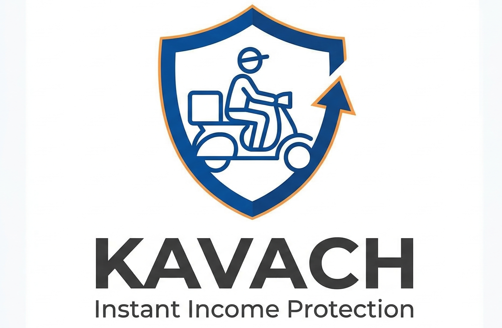
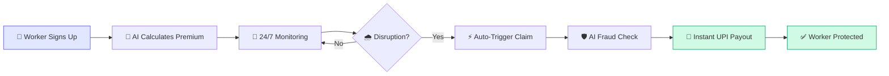
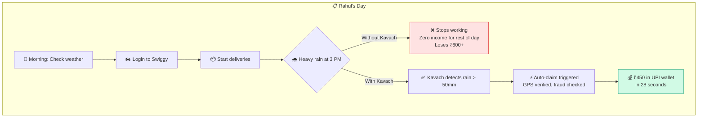
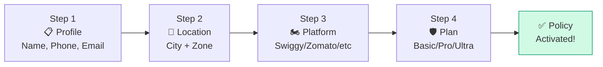
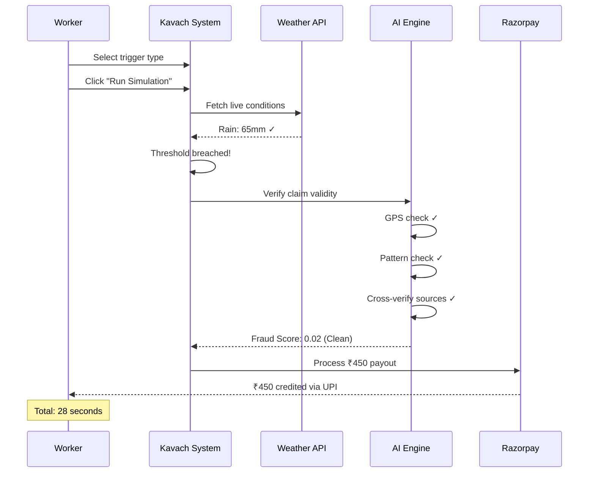
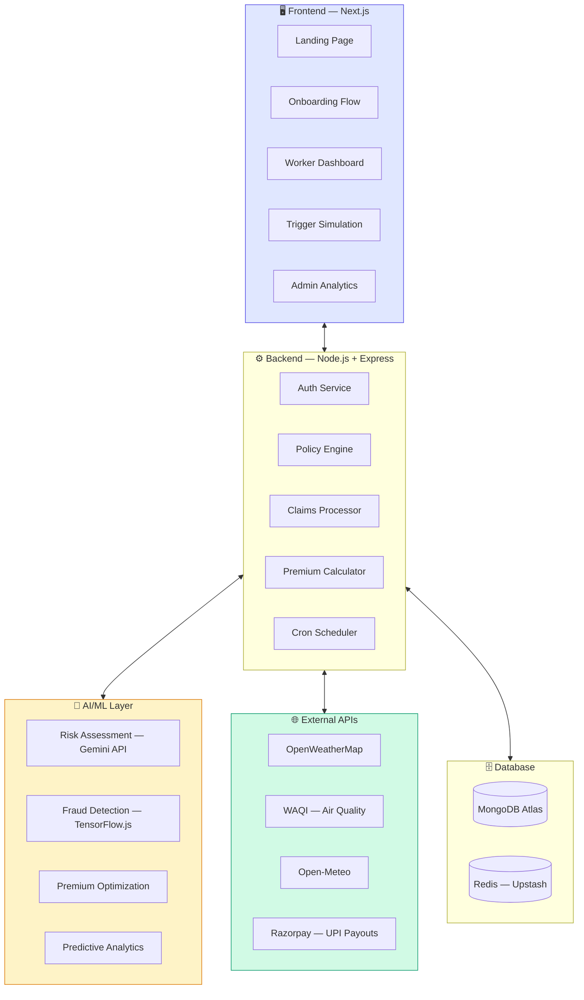
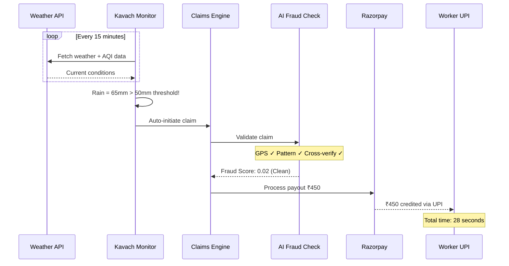
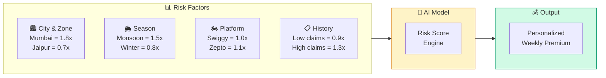
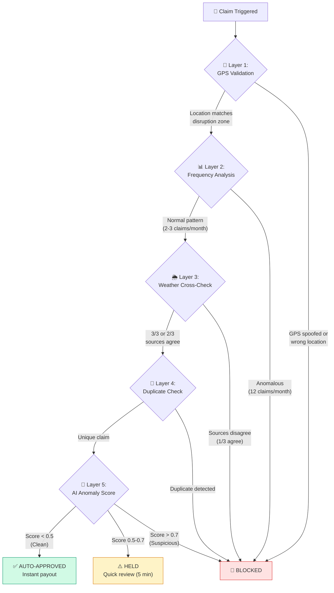

<p align="center">
  
</p>

<h1 align="center">Kavach — AI-Powered Income Protection for Gig Workers</h1>

<p align="center">
  <strong>Parametric insurance that pays delivery workers instantly when disruptions strike.</strong><br/>
  No claims. No paperwork. Just protection.
</p>

<p align="center">
  
  
  
  
</p>

---

## 📌 Problem Statement

India has **50M+ gig delivery workers** powering platforms like Zomato, Swiggy, Zepto, and Amazon. When external disruptions hit — heavy rainfall, extreme pollution, platform outages — these workers lose **20–30% of their monthly earnings** with **zero income protection**.

Traditional insurance doesn't work for them:
- ❌ Slow claims processing (72+ hours)
- ❌ Complex paperwork that workers can't navigate
- ❌ Monthly premiums misaligned with weekly pay cycles
- ❌ No coverage for gig-specific income loss

---

## 💡 Our Solution: Kavach

**Kavach** (कवच — "armor" in Hindi) is an AI-powered **parametric insurance platform** that automatically protects delivery workers' income.

### How Kavach Works — End-to-End Flow



### Key Differentiators

| Traditional Insurance | Kavach (Parametric) |
|---|---|
| Manual claim filing | **Fully automatic** — zero human intervention |
| 72+ hour processing | **< 30 seconds** payout via UPI |
| Monthly premiums | **Weekly pricing** (₹49–149/week) |
| Subjective assessment | **Data-driven triggers** from APIs |
| One-size-fits-all | **AI-personalized** risk & premium per worker |

---

## 🎯 Persona: Food Delivery Worker

We chose **food delivery** as our primary persona (Zomato / Swiggy workers).

### Persona Profile

| Attribute | Details |
|---|---|
| **Name** | Rahul K. (Archetype) |
| **Age** | 22–35 years |
| **Platform** | Swiggy, Zomato |
| **City** | Mumbai, Delhi, Bangalore |
| **Daily Earnings** | ₹600–1,200 |
| **Working Hours** | 10–14 hrs/day, peak during meals |
| **Key Pain Point** | Loses ₹400–800 on disruption days |
| **Tech Comfort** | Smartphone-first, UPI-savvy |

### Persona Workflow — A Day with Kavach



---

## 📱 Application Pages — Detailed Walkthrough

### Page 1: Landing Page (`/`)

The first thing workers and investors see. Designed to instantly communicate Kavach's value.

| Section | What It Shows | Purpose |
|---|---|---|
| **Hero** | "Delivery earnings. Always protected." + CTA button | Instant value proposition |
| **Live Status Cards** | Current Weather (Heavy Rain), Coverage (COVERED), Auto-Payout (₹450 in 28s) | Real-time proof it works |
| **How It Works** | 4-step visual: Connect → Monitor → Detect → Pay | Simplify the concept |
| **Coverage Types** | Weather, Pollution, Platform Outages | Show what's covered |
| **Pricing** | 3 plans: Basic ₹49, Pro ₹99, Ultra ₹149 | Clear pricing |
| **Stats** | 10,000+ workers, <30s payouts, AI-powered | Build trust |
| **CTA** | "Start your 7-day free trial" | Drive action |

---

### Page 2: Onboarding (`/onboarding`)

4-step guided signup — designed for smartphone-first workers, completable in under 2 minutes.



| Step | Input | Why It Matters |
|---|---|---|
| **Profile** | Name, phone, email | Identity for payouts |
| **Location** | City (100+ Indian cities) + delivery zone | **Risk assessment** — Mumbai monsoon zone = higher risk |
| **Platform** | Swiggy, Zomato, Zepto, Blinkit | Income pattern varies by platform |
| **Plan** | Basic / Pro / Ultra | Coverage level selection |

**On completion**: Animated success screen with policy number (KV-2026-XXXX), coverage summary, and premium amount.

---

### Page 3: Worker Dashboard (`/dashboard`)

The worker's personal control panel — everything at a glance.

| Section | Content | Key Insight |
|---|---|---|
| **Welcome Header** | Name, city, platform, active status badge | Personalized experience |
| **4 KPI Cards** | Coverage plan, Total protected (₹8,350), Payout speed (28s), Risk score (Low-Med) | Key metrics at a glance |
| **Live Conditions** | Rain (22mm), Temp (34°C), Wind (18 km/h), AQI (182) with status badges | Worker sees current risk level |
| **Alert Banner** | "Heavy rain expected tomorrow. Auto-coverage will activate if threshold breached." | Predictive AI warning |
| **Earnings Chart** | Line chart: Earnings vs Protected Income over 6 months | Visualize protection value |
| **Monthly Payouts** | Bar chart: ₹ received per month | Payout history |
| **Recent Payouts Table** | Date, trigger, amount, status (completed/processing) | Detailed transaction log |
| **Policy Details** | Policy ID, plan, dates, covered triggers | Full policy info |

---

### Page 4: Trigger Simulation (`/simulate`)

**The star of the demo** — shows the entire Kavach system working end-to-end.



**4 selectable triggers**: Heavy Rainfall, Severe Pollution, Extreme Heat, Platform Outage. Each runs through:

| Step | What Happens | Time |
|---|---|---|
| 📡 Real-time monitoring | Scanning weather APIs, AQI feeds | 0–3s |
| 🌧️ Disruption detected | "Heavy Rainfall — threshold breached" | 3–6s |
| 🤖 Auto-claim initiated | Verifying location, policy, trigger validity | 6–10s |
| ✅ Claim approved | "Fraud checks passed. Auto-approved." | 10–15s |
| 💸 Instant payout | "₹450 sent to worker's UPI" | 15–25s |
| 🛡️ Worker protected | "28 seconds. Zero human intervention." | 25–28s |

---

### Page 5: Admin Dashboard (`/admin`)

Insurer/company analytics view for managing the entire platform.

| Section | Content | Business Value |
|---|---|---|
| **4 KPI Cards** | Active Policies (10,248 ↑12.4%), Total Payouts (₹24.2L ↑8.7%), Fraud Blocked (49 ↓22%), Loss Ratio (62.4% ↓3.1%) | Platform health at a glance |
| **Claims & Fraud Trend** | Line chart: legitimate claims vs fraud attempts over 8 weeks | Track fraud reduction |
| **Trigger Distribution** | Donut chart: Weather 45%, AQI 25%, Heat 20%, Platform 10% | Understand risk mix |
| **City-wise Claims** | Bar chart: Mumbai, Delhi, Bangalore, Hyderabad, Chennai | Regional risk patterns |
| **Predictive Forecast** | AI prediction for next week's expected claims | Proactive risk management |
| **Live Activity Feed** | Real-time log of policy activations, payouts, alerts | Operational monitoring |

---

## 🏗️ System Architecture



---

## 📡 Parametric Triggers

### Trigger Matrix

| Trigger | Data Source | Threshold | Payout Range |
|---|---|---|---|
| 🌧️ Heavy Rainfall | OpenWeatherMap API | > 50mm/hr | ₹300–600 |
| 🌡️ Extreme Heat | Open-Meteo API | > 45°C | ₹250–500 |
| 💨 Severe Pollution | WAQI API | AQI > 400 | ₹300–500 |
| ⚡ Platform Outage | Status Monitor | > 4 hrs down | ₹200–400 |
| 🌊 Flood / Cyclone | Weather Alerts API | Severe warning | ₹500–1000 |

### Trigger Processing Flow



---

## 💰 Premium Calculation — Deep Dive

### Fixed Plans (Phase 1 — Current)

| Plan | Weekly Premium | Max Daily Payout | Covers |
|---|---|---|---|
| **Basic Shield** | ₹49/week (₹7/day) | ₹300 | Weather only |
| **Pro Shield** ⭐ | ₹99/week (₹14/day) | ₹600 | Weather + Pollution + Outage |
| **Ultra Shield** | ₹149/week (₹21/day) | ₹1,000 | All triggers + Predictive alerts |

### AI-Dynamic Premium (Phase 2)

In Phase 2, premiums will be **personalized per worker** using an ML model:

```
Premium = Base Rate × City Risk × Season Factor × Platform Factor × Claims History
```



### Example: Premium Comparison

| Factor | Rahul (Mumbai, July) | Priya (Bangalore, January) |
|---|---|---|
| Base Rate | ₹49 | ₹49 |
| City Risk | × 1.8 (flood-prone) | × 0.9 (moderate climate) |
| Season | × 1.5 (monsoon) | × 0.8 (dry winter) |
| Platform | × 1.0 (Swiggy) | × 1.0 (Zomato) |
| Claims History | × 1.0 (new user) | × 0.9 (low claims) |
| **Final Premium** | **₹132/week** | **₹32/week** |

> **Why the difference?** Mumbai in monsoon season has 3x the rain-day probability of Bangalore in winter. Higher risk = higher premium, but the payout coverage is also higher.

### Payout Calculation

```
Payout = Worker's Avg Daily Earning × Disruption Severity × Coverage Factor
```

| Severity Level | Rain Amount | Coverage Factor | Example (₹800/day avg) |
|---|---|---|---|
| **Moderate** | 30–50mm | 50% | ₹400 |
| **Heavy** | 50–100mm | 75% | ₹600 |
| **Extreme** | 100mm+ / Flood | 100% | ₹800 (capped by plan) |

**Real example**: Rahul earns ₹800/day on Swiggy. Heavy rain (65mm) hits Mumbai:
- Payout = ₹800 × 75% = **₹600**
- On **Pro plan** (max ₹600/day) → Gets **₹600** ✅
- On **Basic plan** (max ₹300/day) → Gets **₹300** (plan limit cap)

### Business Viability

| Metric | Calculation |
|---|---|
| Weekly premium collected | 10,000 workers × ₹99 avg = **₹9.9L/week** |
| Weekly payouts | ~15% trigger rate × ₹450 avg = **₹6.75L/week** |
| **Gross margin** | **~32%** |
| Loss ratio | ~68% (healthy for insurance industry) |

---

## 🛡️ Fraud Detection — Deep Dive

Kavach uses a **5-layer fraud detection system** to prevent abuse. Every claim passes through ALL layers in under 5 seconds.

### Fraud Detection Architecture



### Layer Details with Real Examples

#### Layer 1: GPS Validation
Checks if the worker is physically in the disruption zone.

> **Example**: Worker Amit claims heavy rain payout in **Mumbai**. But his GPS shows he's actually in **Pune** (150km away) where it's sunny.
>
> ❌ **Result**: Blocked. Location doesn't match disruption zone.

> **GPS Spoofing Example**: Worker uses a fake GPS app to show Mumbai location, but cell tower data and movement velocity (teleported instantly) don't match.
>
> ❌ **Result**: Blocked. Spoofing pattern detected.

---

#### Layer 2: Claim Frequency Analysis
Flags workers who claim suspiciously often compared to zone averages.

> **Example**: In Mumbai Andheri zone, average worker claims **2–3 times/month**. Suresh has claimed **12 times this month** — 4x the zone average.
>
> 🚩 **Result**: Flagged. Sent for manual review.

---

#### Layer 3: Weather Cross-Verification
Multiple API sources must agree on conditions before approving a payout.

```
OpenWeatherMap:  65mm rain  ✅ (above 50mm threshold)
Open-Meteo:     58mm rain  ✅ (above 50mm threshold)  
WAQI:           Storm AQI  ✅ (consistent with heavy rain)

Consensus: 3/3 agree → ✅ AUTO-APPROVE
```

> **Failed example**: OpenWeatherMap says 80mm rain, but Open-Meteo says 15mm and WAQI shows normal conditions. Only 1/3 sources agree.
>
> 🚩 **Result**: Held. Likely a data glitch in one API.

---

#### Layer 4: Duplicate Claim Prevention
Same worker, same trigger, same day = blocked.

> **Example**: Heavy rain at 3 PM → Amit receives ₹450 at 3:02 PM. At 5 PM, rain continues. System tries to trigger another claim.
>
> ❌ **Result**: Blocked. One payout per trigger event per 24 hours.

> **Multi-account example**: Worker registers with 2 phone numbers. Both claim rain from the same GPS location.
>
> ❌ **Result**: Blocked. Duplicate device fingerprint detected.

---

#### Layer 5: AI Anomaly Scoring

Every claim gets a **fraud score from 0 to 1**:

| Score Range | Classification | Action |
|---|---|---|
| 0.00 – 0.30 | ✅ Clean | Auto-approve, instant payout |
| 0.30 – 0.50 | ⚠️ Low risk | Auto-approve with monitoring |
| 0.50 – 0.70 | 🟡 Moderate | Hold for quick review (5 min) |
| 0.70 – 0.90 | 🟠 High risk | Manual review required |
| 0.90 – 1.00 | 🔴 Fraud | Auto-block, account flagged |

> **Clean claim example**:
> - GPS: ✅ Mumbai (matches rain zone)
> - Rain: ✅ 65mm (above threshold)
> - Cross-verify: ✅ 3/3 APIs agree
> - Frequency: ✅ 2nd claim this month
> - Account age: ✅ 3 months old
>
> **Fraud Score: 0.02 → ✅ Auto-approved. ₹450 paid in 28 seconds.**

> **Suspicious claim example**:
> - GPS: ⚠️ Edge of rain zone
> - Rain: ✅ 52mm (barely above threshold)
> - Cross-verify: ⚠️ 2/3 APIs agree
> - Frequency: 🚩 8th claim this month (4x average)
> - Account age: 🚩 Created 3 days ago
>
> **Fraud Score: 0.78 → 🔴 Held for manual review.**

---

## 🛠️ Tech Stack

### Current (Phase 1 — Prototype)

| Layer | Technology | Purpose |
|---|---|---|
| **Framework** | Next.js 16 (App Router, TypeScript) | Full-stack React framework |
| **Styling** | Tailwind CSS | Utility-first CSS framework |
| **Animations** | Framer Motion | Smooth page transitions & interactions |
| **Charts** | Recharts | Dashboard data visualizations |
| **Icons** | Lucide React | Consistent icon system |

### Planned (Phase 2–3)

| Layer | Technology | Purpose |
|---|---|---|
| **Backend** | Node.js 20 + Express.js | REST API server |
| **Database** | MongoDB Atlas (M0 Free) | Users, policies, claims data |
| **Cache** | Redis (Upstash Free) | Session management, rate limiting |
| **AI/ML** | Google Gemini API | Risk assessment, fraud analysis |
| **ML Models** | TensorFlow.js | Premium calculation, anomaly detection |
| **Auth** | NextAuth.js | Worker & admin authentication |
| **Payments** | Razorpay (Test Mode) | UPI payout processing |
| **Weather** | OpenWeatherMap API | Real-time weather monitoring |
| **AQI** | WAQI API | Air quality index tracking |
| **Forecast** | Open-Meteo API | Weather predictions & alerts |
| **Notifications** | Twilio (Trial) | SMS alerts to workers |
| **Hosting** | Vercel + Render | Frontend + Backend deployment |

---

## 🚀 Getting Started

### Prerequisites
- Node.js 18+ 
- npm or yarn

### Installation

```bash
# Clone the repository
git clone https://github.com/DunakaChetan/Kavach-GW.git
cd kavach

# Install dependencies
npm install

# Start development server
npm run dev
```

Open [http://localhost:3000](http://localhost:3000) in your browser.

### Build for Production

```bash
npm run build
npm start
```

---

## 📂 Project Structure

```
kavach/
├── public/
│   └── Kavach-Logo.png          # Brand logo
├── src/
│   ├── app/
│   │   ├── layout.tsx           # Root layout (navbar + footer)
│   │   ├── page.tsx             # Landing page
│   │   ├── globals.css          # Design system & global styles
│   │   ├── icon.png             # Favicon
│   │   ├── onboarding/
│   │   │   └── page.tsx         # 4-step onboarding flow
│   │   ├── dashboard/
│   │   │   └── page.tsx         # Worker dashboard
│   │   ├── simulate/
│   │   │   └── page.tsx         # Trigger simulation demo
│   │   └── admin/
│   │       └── page.tsx         # Admin analytics dashboard
│   └── components/
│       ├── Navbar.tsx            # Navigation bar
│       └── Footer.tsx            # Footer
├── package.json
├── tailwind.config.ts
└── tsconfig.json
```

---

## 🗺️ Development Roadmap


---

## 🔮 Use Case Scenarios

### Scenario 1: Normal Day (No Payout)
```
Weather: Sunny, 32°C, AQI 120
→ Kavach monitors: All normal ✅
→ No trigger → No claim → Worker earns normally
→ Premium continues (₹14/day on Pro plan)
```

### Scenario 2: Heavy Rain (Auto-Payout)
```
Weather: 65mm rainfall at 3 PM in Mumbai
→ Kavach detects: Rain > 50mm threshold ⚡
→ Auto-claim → GPS verified → Fraud score 0.02
→ ₹450 sent to UPI in 28 seconds ✅
→ Worker protected without lifting a finger
```

### Scenario 3: Fraud Attempt (Blocked)
```
Worker claims rain payout in Mumbai
→ GPS Check: Worker is actually in Pune 🚩
→ Fraud score: 0.92
→ Claim BLOCKED ❌
→ Account flagged for review
```

### Scenario 4: Multiple Disruptions in One Week
```
Monday: Heavy rain → ₹450 paid ✅
Wednesday: AQI 420 → ₹350 paid ✅
Friday: Platform outage 5hrs → ₹200 paid ✅
Weekly total protected: ₹1,000
Weekly premium paid: ₹99
Worker ROI: 10x return on premium 📈
```

---

## 👥 Team

| Role | Responsibility |
|---|---|
| **Full-Stack Developer** | Frontend prototype, backend API, database |
| **AI/ML Engineer** | Risk models, fraud detection, premium optimization |
| **Product Lead** | Strategy, persona research, pitch preparation |

---

## 📄 License

This project is built for the **Guidewire DEVTrails 2026** hackathon.

---

<p align="center">
  <strong>Kavach</strong> — Because every delivery matters. 🛡️
</p>
